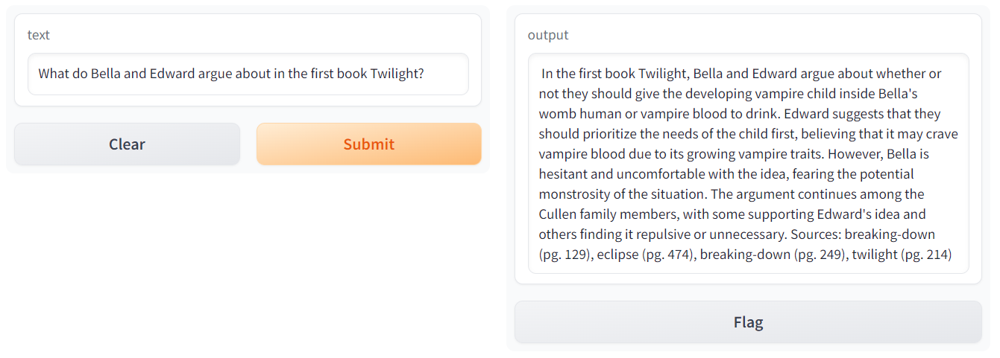

# RAG-BookSaga-QA
Ask questions to PDFs via RAG using Mistral7B

## Description
[RAG Jupyter Notebook](RAG_BookSaga_QA.ipynb) contains an implementation of a Retrieval Augmented Generation system used to ask questions about the Twilight book saga. It uses Mistral 7B as the Language Model and bge-base-en-v1.5 embedding model for document and query embedding generation. LangChain is used as the primary tool to build the RAG.

## Examples

In the presented example, the system retrieves correctly relevant information from each book in the saga, showcasing a cohesive narrative in response to general queries about the entire series. This success is attributable in part to the incorporation of release order dates within the prompt template utilized, enhancing the model's contextual understanding.

    

Nonetheless, the current approach falls short in some cases. When queried about an specific book, the system retrieves information from all documents as it checks for similarity among all the embeddings.  To address this, a proposed future enhancement involves implementing a hybrid search methodology. This approach combines vector search with sparse search, enabling the system to identify relevant keywords, such as "Twilight," during the retrieval phase, thereby refining the results.
Additionally, ongoing improvements are planned, including the utilization of more robust vector databases and the integration of metadata filtering through entity recognition. 

    

## Author
* Lucia Urcelay
